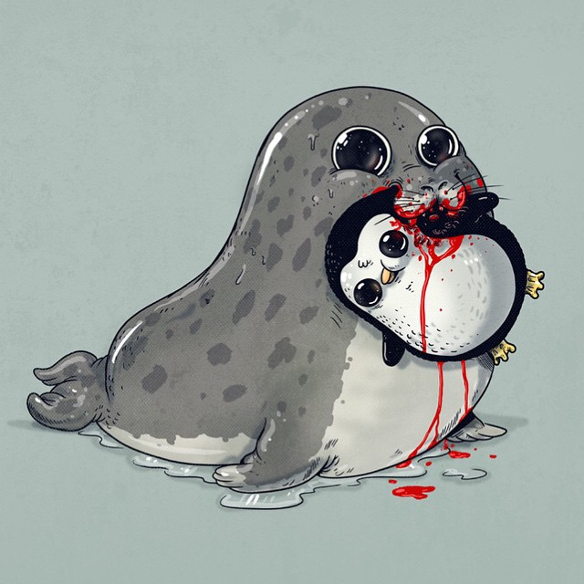

```{r setup, include=FALSE, fig.align = 'center'}
knitr::opts_chunk$set(echo = FALSE, fig.align = 'center')
library(FFTrees)


#  Step 2: Create the FFTrees object
heart_FFT <- FFTrees(formula = diagnosis ~., # Criterion
                     data = heart.train,     # Training data
                     data.test = heart.test, # Testing data
                     main = "Heart Disease", # Optional Labels
                     decision.labels = c("Healthy", "Diseased")) 


```

class: title-slide-custom

.pull-left65[

<br><br><br>
# FFTrees

##A toolbox to create, visualise, and use fast-and-frugal decision trees
<br>

### Nathaniel D. Phillips, University of Basel

Coauthors: Hansjoerg Neth, Jan Woike, Wolfgang Gaissmaier


<br><br>

]

.pull-right35[

<br><br><br><br>
```{r, out.width = "100%"}
knitr::include_graphics("images/heartfft.png")
```

]

---

<br><br><br><br><br>

# How can one make good decisions based on limited, complex, noisy information?

---

```{r}
knitr::include_graphics(c("images/three_ex_1.png"))
```

---
count: false

```{r}
knitr::include_graphics(c("images/three_ex_2.png"))
```

---
count: false

```{r}
knitr::include_graphics(c("images/three_ex_3.png"))
```

---
count: false

```{r}
knitr::include_graphics(c("images/three_ex_4.png"))
```

---

```{r, out.width = "100%"}
knitr::include_graphics(c("images/er_busy_1.png"))
```

---
count: false

```{r, out.width = "100%"}
knitr::include_graphics(c("images/er_busy_2.png"))
```

---

```{r, out.width = "100%"}
knitr::include_graphics(c("images/er_decision_1.png"))
```

---
count: false

```{r, out.width = "100%"}
knitr::include_graphics(c("images/er_decision_2.png"))
```

---
count: false

```{r, out.width = "100%"}
knitr::include_graphics(c("images/er_decision_3.png"))
```

---
count: false

```{r, out.width = "100%"}
knitr::include_graphics(c("images/er_decision_4.png"))
```

---
count: false

```{r, out.width = "100%"}
knitr::include_graphics(c("images/er_decision_5.png"))
```

---
count: false

```{r, out.width = "100%"}
knitr::include_graphics(c("images/er_decision_6.png"))
```

---
count: false

```{r, out.width = "100%"}
knitr::include_graphics(c("images/er_decision_7.png"))
```

---
count: false

```{r, out.width = "100%"}
knitr::include_graphics(c("images/er_decision_8.png"))
```

---

```{r, out.width = "100%"}
knitr::include_graphics(c("images/green_mehr_fft.png"))
```

---

```{r, out.width = "100%"}
knitr::include_graphics(c("images/whatis_fft_1.png"))
```

---
count: false

```{r, out.width = "100%"}
knitr::include_graphics(c("images/whatis_fft_2.png"))
```

---
count: false

```{r, out.width = "100%"}
knitr::include_graphics(c("images/whatis_fft_3.png"))
```

---
count: false

```{r, out.width = "100%"}
knitr::include_graphics(c("images/whatis_fft_4.png"))
```

---
count: false

```{r, out.width = "100%"}
knitr::include_graphics(c("images/whatis_fft_5.png"))
```

---

```{r, out.width = "100%"}
knitr::include_graphics(c("images/fft_examples.png"))
```


---

```{r, out.width = "100%"}
knitr::include_graphics(c("images/fftrees_intro.png"))
```

---
# Heart Disease


| age| sex|cp | trestbps| chol| fbs|restecg     | thalach| exang| oldpeak|slope | ca|thal   | diagnosis|
|---:|---:|:--|--------:|----:|---:|:-----------|-------:|-----:|-------:|:-----|--:|:------|---------:|
|  63|   1|ta |      145|  233|   1|hypertrophy |     150|     0|     2.3|down  |  0|fd     |         0|
|  67|   1|a  |      160|  286|   0|hypertrophy |     108|     1|     1.5|flat  |  3|normal |         1|
|  67|   1|a  |      120|  229|   0|hypertrophy |     129|     1|     2.6|flat  |  2|rd     |         1|
|  37|   1|np |      130|  250|   0|normal      |     187|     0|     3.5|down  |  0|normal |         0|
|  41|   0|aa |      130|  204|   0|hypertrophy |     172|     0|     1.4|up    |  0|normal |         0|
|  56|   1|aa |      120|  236|   0|normal      |     178|     0|     0.8|up    |  0|normal |         0|


---
# 4 Steps to using FFTrees in R

.pull-left15[
<br>


<font size = 5>0.Install</font>
<br>

<font size = 5>1. Load</font>
<br>
<br>
<font size = 5>2. Create</font>
<br>
<br><br>
<br><br>
<font size = 5>3. Print</font>
<br><br>

<font size = 5>4. Plot</font>
<br>

]

.pull-right85[

```{r, eval = FALSE, echo = TRUE}
# Step 0: Install FFTrees from CRAN
install.packages("FFTrees")

# Step 1: Load FFTrees
library(FFTrees)

#  Step 2: Create the FFTrees object
heart_FFT <- FFTrees(formula = diagnosis ~., # Criterion
                     data = heart.train,     # Training data
                     data.test = heart.test, # Testing data
                     main = "Heart Disease", # Optional Labels
                     decision.labels = c("Healthy", "Diseased")) 

# Step 3: Print the object
heart_FFT

# Step 4: Plot the tree and accuracy statistics
plot(heart_FFT)
```

]

---

# ShinyFFTrees: http://www.shinyfftrees.org

<iframe src="https://econpsychbasel.shinyapps.io/shinyfftrees/" width="1100" height="500"></iframe>


---
## plot(heart_FFT, stats = FALSE)

---
count: false


## plot(heart_FFT, stats = FALSE)

.pull-left5[

```{r, out.width = "70%"}
knitr::include_graphics("images/heart_fft_nostats_2.png")
```

]

.pull-right5[
<br><br><br>
###thal
<br2>

<font size=5>Imaging test that measures blood flow to the heart</font>

### cp
<br2>

<font size=5>Type of chest pain</font>

### ca
<br2>

<font size=5>Number of major vessels colored by fluoroscopy</font>


]
---

## plot(heart_FFT)

---
count: false

## plot(heart_FFT)

.pull-left7[

```{r, out.width = "80%"}
knitr::include_graphics("images/heart_fft_train.png")
```

]

.pull-right3[

<br>

<font size = 5>Starts with dataset description</font>

<br><br>

<font size = 5>Tree <b>and</b> step-by-step decisions applied to data</font>

<br><br><br>

<font size = 5>Aggregate classification statistics and algorithm comparison in ROC</font>


]

---

## plot(heart_FFT, data = "test")


.pull-left7[


```{r, out.width = "80%"}
knitr::include_graphics("images/heart_fft_test.png")
```

]

.pull-right3[

<br>

<font size = 5>Easily apply tree to <b>new, test data</b></font>

<br><br>

<font size = 5>Look for changes in when decisions are made, and when <b>errors</b> occur</font>

<br><br><br>

<font size = 5>Compare prediction accuracy to other algorithms</font>


]


---

## plot(heart_FFT, data = "test", tree = 7)

.pull-left7[


```{r, out.width = "80%"}
knitr::include_graphics("images/heart_fft_test_tree7.png")
```

]

.pull-right3[

<br><br>

<font size = 5>Explore trees with different <b>exit structures</b> and <b>error trade-offs</b></font>

<br><br>

<font size = 5>Tree #7 has a very low false-alarm rate but a huge number of misses></font>

<br><br>


]


---
## plot(heart_FFT, data = "test", tree = 6)


.pull-left7[


```{r, out.width = "80%"}

```

]

.pull-right3[


<br><br>

<font size = 5>Explore trees with different <b>exit structures</b> and <b>error trade-offs</b></font>

<br><br>

<font size = 5>Tree #6 has very few misses but a huge number of false-alarms></font>

<br><br>
]


---
<br><br><br>

# I know what you're thinking...

---
.pull-left5[
<br><br><br>

# I know what you're thinking...

<br>


]

.pull-right5[

```{r, out.width = "90%"}

```

]


---
.pull-left5[
<br><br><br>

# I know what you're thinking...

<br>

### FFTs are cute, but they can't possibly compete with [insert your favorite ML algorithm] in raw predictive power.

]

.pull-right5[

```{r, out.width = "90%"}

```

Source: Alex ‘alexmdc’ Solis

]

---

# 10 datasets from UCI ML database,   50/50 CV,    100 Splits

```{r, out.width = "100%"}
knitr::include_graphics("images/ten_datasets.png")
```

---

.pull-left5[

# Make a Prediction!

<br>
<br>

<font size = 6>What will the median relative accuracy of FFTrees be to Random Forests?</font>

]

.pull-right5[

]

---

.pull-left5[

# Make a Prediction!

<br>
<br>

<font size = 6>What will the median relative accuracy of FFTrees be to Random Forests?</font>

]

.pull-right5[

```{r, out.width = "90%"}
knitr::include_graphics("images/predict_relacc_1.png")
```

]

---

```{r, out.width = "70%"}

```

---
count: false

```{r, out.width = "70%"}
knitr::include_graphics("images/simulation_speed_2.png")
```

---
count: false

```{r, out.width = "70%"}
knitr::include_graphics("images/simulation_speed_3.png")
```

---

```{r, out.width = "100%"}

```

---
count: false
```{r, out.width = "100%"}
knitr::include_graphics("images/simulation_accuracy_2.png")
```

---
count: false

```{r, out.width = "100%"}
knitr::include_graphics("images/simulation_accuracy_3.png")
```

---
count: false

```{r, out.width = "100%"}
knitr::include_graphics("images/simulation_accuracy_4.png")
```

---
count: false

```{r, out.width = "100%"}

```

---
count: false

```{r, out.width = "100%"}
knitr::include_graphics("images/simulation_accuracy_6.png")
```

---

.pull-left5[


# Make a Prediction!

<br>
<br>

<font size = 6>What will the median relative accuracy of FFTrees be to Random Forests?</font>


]

.pull-right5[

```{r, out.width = "90%"}
knitr::include_graphics("images/predict_relacc_1.png")
```

]

---
count: false

.pull-left5[

# Make a Prediction!

<br>
<br>

<font size = 6>What will the median relative accuracy of FFTrees be to Random Forests?</font>

]

.pull-right5[

```{r, out.width = "90%"}

```

]

---

<br>
<br>
<br>
<br>

# The Dark Secret at the heart of AI and big data


---
count: false

<br>
<br>
<br>
<br>

# The Dark Secret at the heart of AI and big data

## What happens when things go wrong?

---
count: false

.pull-left5[

]

.pull-right5[

<br><br>
```{r, out.width = "70%", echo = FALSE}
knitr::include_graphics("images/darksecretai.png")
```

]


---
count: false

.pull-left5[

<br><br><br>

> <font size=6>[W]hat if one day [an automated car] did something unexpected—crashed into a tree, or sat at a green light? [...] The system is so complicated that even the engineers who designed it may struggle to isolate the reason for any single action.</font>
> <br>
> <br>
> <font size=5>~ Will Knight, MIT Technology Review, April 2017</font>


]

.pull-right5[

<br><br>
```{r, out.width = "70%", echo = FALSE}
knitr::include_graphics("images/darksecretai.png")
```

]


---

```{r, out.width = "100%", echo = FALSE}

```

---
count: false

```{r, out.width = "100%", echo = FALSE}

```


---
## Slow or fast gains?

```{r, out.width = "75%", echo = FALSE}

```

---
count: false

## Slow or fast gains?

```{r, out.width = "75%", echo = FALSE}

```

---
count: false

## Slow or fast gains?

```{r, out.width = "75%", echo = FALSE}

```


---
count: false

## Slow or fast gains?

```{r, out.width = "75%", echo = FALSE}

```

---
count: false

## Slow or fast gains?

```{r, out.width = "75%", echo = FALSE}

```


---
class: title-slide-custom

.pull-left55[

<br>
# FFTrees

##A toolbox to create, visualise, and use fast-and-frugal decision trees
<br>

<font size=5>Nathaniel D. Phillips, University of Basel</font>

Hansjoerg Neth, Jan Woike, Wolfgang Gaissmaier


<br>

<font size=4>Nathaniel.D.Phillips.is@gmail.com</font>

<br3>
<font size=4><a href="http://ndphillips.github.io/presentations/Informs_2017/Informs_2017.html">http://ndphillips.github.io/Informs2017/Informs2017</a></font>
<br3>
<font size=4>ShinyFFTrees: <a href="http://www.shinyfftrees.org">http://www.shinyfftrees.org</a></font>

]

.pull-right4[

<br><br>

<font size=4>Phillips, N. D., Neth, H., Woike, J. K., & Gaissmaier, W. (2017). FFTrees [...]. Judgment and Decision Making, 12(4).</font>

```{r, out.width = "100%"}

```

]


---
# Backup Slides


---

<br>

# Will you benefit from FFTrees?

<br><br><br>

> # What kind of data world do you live in?

---

```{r, out.width = "100%"}

```

---
count: false

```{r, out.width = "100%"}

```

---
count: false

```{r, out.width = "100%"}

```

---
count: false

```{r, out.width = "100%"}

```

---
count: false

```{r, out.width = "100%"}

```

---
count: false

```{r, out.width = "100%"}

```

---
count: false

```{r, out.width = "100%"}

```

---
count: false

```{r, out.width = "100%"}
knitr::include_graphics("images/dataworld_8.png")
```

---
count: false

```{r, out.width = "100%"}

```

---
count: false

```{r, out.width = "100%"}

```


---

```{r, out.width = "100%"}
knitr::include_graphics("images/simulation_accuracy_tree_1.png")
```

---

```{r, out.width = "100%"}
knitr::include_graphics("images/simulation_accuracy_tree_2.png")
```


---
<br><br><br>

# Additional Features

---

```{r, out.width = "90%"}

```


---

# Documentation

.pull-left45[

### Phillips et al. (2017). FFTrees: A toolbox to create...

```{r, out.width = "100%"}
knitr::include_graphics(c("images/manuscript_cover_short.png"))
```

]

.pull-right45[
### <a href = "http://www.shinyfftrees.org">http://www.shinyfftrees.org</a>

```{r, out.width = "100%"}
knitr::include_graphics(c("images/shinyfftrees_ss.png"))
```

]

---
# Closing slide


---
# To Do

- Get shinyfftrees.org
- 


