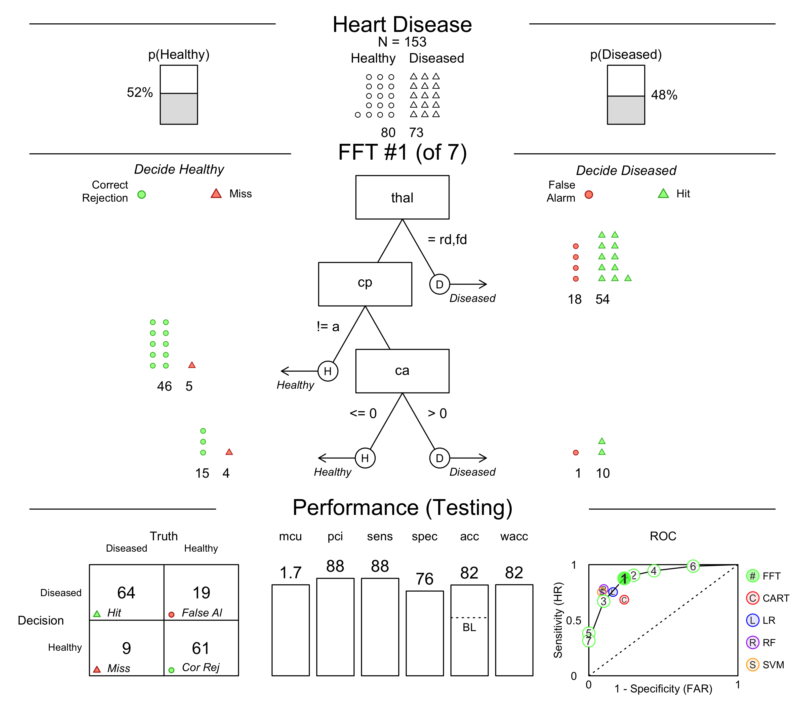
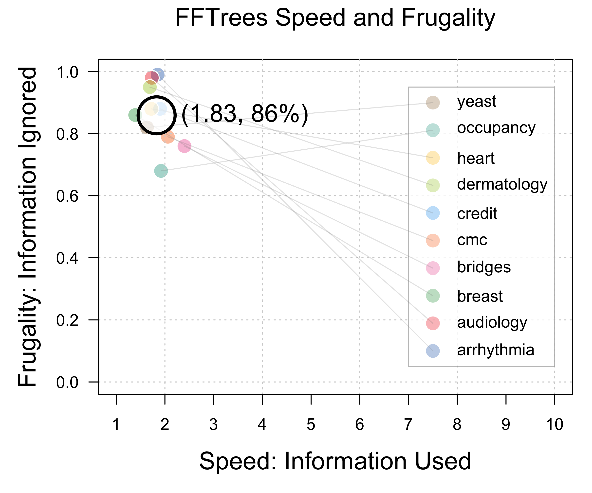
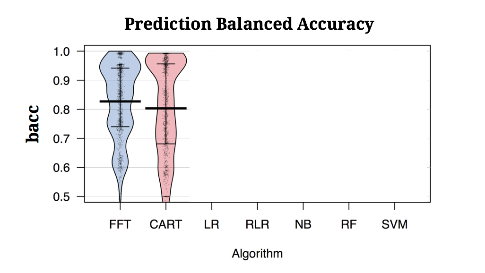

```{r setup, include=FALSE, fig.align = 'center'}
knitr::opts_chunk$set(echo = FALSE, fig.align = 'center')
library(FFTrees)


#  Step 2: Create the FFTrees object
heart_FFT <- FFTrees(formula = diagnosis ~., # Criterion
                     data = heart.train,     # Training data
                     data.test = heart.test, # Testing data
                     main = "Heart Disease", # Optional Labels
                     decision.labels = c("Healthy", "Diseased")) 


htmltools::tagList(rmarkdown::html_dependency_font_awesome())

```

class: title-slide-custom

.pull-left65[

<br><br><br>

## Creating transparent, powerful decision aids with FFTrees

<br>

<font size = 6> Dr. Nathaniel D. Phillips</font>
<br><br><br3>
<font size = 5><i class="fa fa-globe"></i><a href = "http://ndphillips.github.io">   http://ndphillips.github.io</a></font>
<br><br3>
<font size = 5><i class="fa fa-envelope-o"></i>   Nathaniel.D.Phillips.is@gmail.com</font>
<br><br3>

<font size = 5><i class="fa fa-tv"></i>   Slides: <a href='http://ndphillips.github.io/RWDS2017'>http://ndphillips.github.io/RWDS2017</a></font>


<br><br>


<font size = 5>Roche, Real World Data Science (RWDS), 13 November, 2017</font>


<br>
]

.pull-right35[

<br><br><br><br>
```{r, out.width = "100%"}
knitr::include_graphics("images/heartfft.png")
```

]

---

<br><br><br><br><br>

# How can one make good decisions based on limited, complex, noisy information?

---

```{r}
knitr::include_graphics(c("images/three_ex_1.png"))
```

---
count: false

```{r}
knitr::include_graphics(c("images/three_ex_2.png"))
```

---
count: false

```{r}
knitr::include_graphics(c("images/three_ex_3.png"))
```

---
count: false

```{r}
knitr::include_graphics(c("images/three_ex_4.png"))
```

---

```{r, out.width = "100%"}
knitr::include_graphics(c("images/er_busy_1.png"))
```

---
count: false

```{r, out.width = "100%"}
knitr::include_graphics(c("images/er_busy_2.png"))
```

---

```{r, out.width = "100%"}
knitr::include_graphics(c("images/er_decision_1.png"))
```

---
count: false

```{r, out.width = "100%"}
knitr::include_graphics(c("images/er_decision_2.png"))
```

---
count: false

```{r, out.width = "100%"}
knitr::include_graphics(c("images/er_decision_3.png"))
```

---
count: false

```{r, out.width = "100%"}
knitr::include_graphics(c("images/er_decision_4.png"))
```

---
count: false

```{r, out.width = "100%"}
knitr::include_graphics(c("images/er_decision_5.png"))
```

---
count: false

```{r, out.width = "100%"}
knitr::include_graphics(c("images/er_decision_6.png"))
```

---
count: false

```{r, out.width = "100%"}
knitr::include_graphics(c("images/er_decision_7.png"))
```

---
count: false

```{r, out.width = "100%"}
knitr::include_graphics(c("images/er_decision_8.png"))
```


---


.pull-left45[

<br>
<br>
### Why are doctor's decisions so bad?
<br>


<br3>

<font size = 5>- Completely exhausted, overwhelmed</font>

<br3>

<font size = 5>- Idiosyncratic, inconsistent decision rules.</font>

<br3>

<font size = 5>- Extremely overconfident</font>

<br3>

<font size = 5>- Defensive decision making</font>


]

.pull-right45[

<br>
<br>

```{r, out.width = "90%", fig.cap="<font size = 3>Source: Christensen-Szalanski and James Bushyhead (1981)</font>"}
knitr::include_graphics(c("images/overconfidence_curve.gif"))
```

]


---

.pull-left5[

<br><br><br><br>
###Solution
<font size = 5>A Fast-and-Frugal decision Tree (FFT) developed by Green & Mehr (1997)<font>
<br4>

### Results
<font size = 5>Far fewer false-alarms and huge cost savings<font>
<br4>

<font size = 5>Unlike complex rules (e.g.; regression), was readily accepted by physicians<font>
<br4>

<font size = 5>Still used at the hospital today<font>
<br4>

]


.pull-right5[


```{r, out.width = "75%"}
knitr::include_graphics(c("images/greenmehr_fft.png"))
```

<font size = 3>Source: Green & Mehr. (1997). What alters physician's decisions to admit to the coronary care unit?</font>

]


---

.pull-left5[

<br><br><br>
## What is an FFT?
<br2>
<font size=5>A <font color = "blue">Fast-and-Frugal Tree</font> (FFT) is a highly restricted decision tree.</font>
<br4>
<font size=5>Each node in the tree must have exactly 2 branches, where 1 branch is an exit branch leading to a decision leaf.</font>
<br4>
<font size=5>The final node must have 2 exit branches.</font>
<br><br><br><br><br><br>
<font size = 3>Martignon et al. (2003). Naive and yet enlightened: From natural frequencies to fast and frugal decision trees</font>

]


.pull-right5[


```{r, out.width = "75%"}
knitr::include_graphics(c("images/blank_fft_B.png"))
```

]


---

.pull-left5[

<br><br><br>
## What is an FFT?
<br2>
<font size=5>A <font color = "blue">Fast-and-Frugal Tree</font> (FFT) is a highly restricted decision tree.</font>
<br4>
<font size=5>Each node in the tree must have exactly 2 branches, where 1 branch is an exit branch leading to a decision leaf.</font>
<br4>
<font size=5>The final node must have 2 exit branches.</font>
<br><br><br><br><br><br>
<font size = 3>*Martignon et al. (2003). Naive and yet enlightened: From natural frequencies to fast and frugal decision trees*</font>

]


.pull-right5[


```{r, out.width = "75%"}
knitr::include_graphics(c("images/fft_cartoon.png"))
```

]

---

.pull-left35[
<br><br><br>
## Benefits of FFTs
<br2>
<font size = 5>1. Transparent</font>
<br4>
<font size = 5>2. Focus (and ignore)</font>
<br4>

<font size = 5>3. Fast and efficient</font>
<br4>

<font size = 5>4. Difficult to overfit</font>
<br4>

<font size = 5>5. Easy to learn, communicate, and modify</font>
<br4>


]


.pull-right6[
<br><br>

```{r, out.width = "100%"}
knitr::include_graphics(c("images/algorithm_comparison.png"))
```

]


---

.pull-left5[

```{r, out.width = "100%"}
knitr::include_graphics(c("images/fft_examples_images.png"))
```


]

.pull-right5[

```{r, out.width = "75%"}
knitr::include_graphics(c("images/blank_fft_B.png"))
```

]


---

.pull-left5[

```{r, out.width = "100%"}
knitr::include_graphics(c("images/fft_examples_images_depression_focus.png"))
```


]

.pull-right5[

### Depression FFT

```{r, out.width = "75%"}
knitr::include_graphics(c("images/depression_fft.png"))
```

<font size = 3>Jenny et al. (2013). Simple rules for detecting depression.</font>


]


---

.pull-left5[

```{r, out.width = "100%"}
knitr::include_graphics(c("images/fft_examples_images_military_focus.png"))
```


]

.pull-right5[

### Miltary Checkpoint FFT
<br>
<br>
```{r, out.width = "75%"}
knitr::include_graphics(c("images/terrorism_fft.png"))
```

<font size = 3>Keller & Katsikopoulos. (2016). On the role of psychological heuristics in operational research.</font>


]


---


.pull-left5[
<br><br>
## How can I make an FFT?

<font size = 5>No off-the-shelf method to create fast-and-frugal trees</font>

## FFTrees

<font size = 5>An extremely simple tool that allows anyone to create FFTs</font>
<br4>
<font size = 5>Visualise decisions using icon arrays</font>
<br4>
<font size = 5>Compare FFTs to other algorithms.</font>

]

.pull-right5[

```{r, out.width = "80%"}
knitr::include_graphics(c("images/rlogo_and_shinyfftrees.png"))
```

]

---
## Ex) Heart Disease

<br3>

<font size = 5><b>Data</b> 150 Training cases, 153 test cases</font>

<br>

| age| sex|cp | trestbps| chol| fbs|restecg     | thalach| exang| oldpeak|slope | ca|thal   | diagnosis|
|---:|---:|:--|--------:|----:|---:|:-----------|-------:|-----:|-------:|:-----|--:|:------|---------:|
|  63|   1|ta |      145|  233|   1|hypertrophy |     150|     0|     2.3|down  |  0|fd     |         0|
|  67|   1|a  |      160|  286|   0|hypertrophy |     108|     1|     1.5|flat  |  3|normal |         1|
|  67|   1|a  |      120|  229|   0|hypertrophy |     129|     1|     2.6|flat  |  2|rd     |         1|
|  37|   1|np |      130|  250|   0|normal      |     187|     0|     3.5|down  |  0|normal |         0|
|  41|   0|aa |      130|  204|   0|hypertrophy |     172|     0|     1.4|up    |  0|normal |         0|
|  56|   1|aa |      120|  236|   0|normal      |     178|     0|     0.8|up    |  0|normal |         0|

<br>

<font size = 5><b>Goal</b> Predict binary criterion (diagnosis) from a set of 13 numeric and factor features</font>
<br4>


<font size = 3>Source: UCI Machine Learning Database</font>


---
## 4 Steps to using FFTrees in R

.pull-left15[
<br3><br3>
<br>
<br>
<font size = 5>0.Install</font>
<br><br>

<font size = 5>1. Load</font>
<br>

<font size = 5>2. Create</font>
<br>
<br><br>
<br><br><br4>
<font size = 5>3. Print</font>
<br><br>

<font size = 5>4. Plot</font>
<br>

]

.pull-right85[

<br>

```{r, eval = FALSE, echo = TRUE}
# Step 0: Install FFTrees from CRAN
install.packages("FFTrees")

# Step 1: Load FFTrees
library(FFTrees)

#  Step 2: Create the FFTrees object
heart_FFT <- FFTrees(formula = diagnosis ~., # Criterion
                     data = heart.train,     # Training data
                     data.test = heart.test, # Testing data
                     main = "Heart Disease", # Optional Labels
                     decision.labels = c("Healthy", "Diseased")) 

# Step 3: Print the object
heart_FFT

# Step 4: Plot the tree and accuracy statistics
plot(heart_FFT)
```

]

---
## plot(heart_FFT, stats = FALSE)

---
count: false


## plot(heart_FFT, stats = FALSE)

.pull-left5[

```{r, out.width = "70%"}
knitr::include_graphics("images/heart_fft_nostats_2.png")
```

]

.pull-right5[
<br><br><br>
###thal
<br2>

<font size=5>Imaging test that measures blood flow to the heart</font>

### cp
<br2>

<font size=5>Type of chest pain</font>

### ca
<br2>

<font size=5>Number of major vessels colored by fluoroscopy</font>


]
---

## plot(heart_FFT)

---
count: false

## plot(heart_FFT)

.pull-left7[

```{r, out.width = "80%"}
knitr::include_graphics("images/heart_fft_train.png")
```

]

.pull-right3[

<br>

<font size = 5>Starts with dataset description</font>

<br><br>

<font size = 5>Tree <b>and</b> step-by-step decisions applied to data</font>

<br><br><br>

<font size = 5>Aggregate classification statistics</font>

]

---
count: false

## plot(heart_FFT)

.pull-left7[

```{r, out.width = "100%"}
knitr::include_graphics("images/heart_train_roc.png")
```

]

.pull-right3[

<br>

<font size = 5>Algorithm comparison in ROC</font>

<br><br>

<font size = 5>Multiple FFTs spanning ROC space</font>

<br><br><br>

]

---

## plot(heart_FFT, data = "test")


.pull-left7[


```{r, out.width = "80%"}

```

]

.pull-right3[

<br>

<font size = 5>Easily apply tree to <b>new, test data</b></font>

<br><br>

<font size = 5>Look for changes in when decisions are made, and when <b>errors</b> occur</font>

<br><br><br>

<font size = 5>Compare prediction accuracy to other algorithms</font>


]


---


<h2> &emsp; &emsp; &emsp;    &emsp;Training &emsp; &emsp;  &emsp; &emsp; &emsp;  Testing</h2>

<br><br>
```{r, out.width = "100%"}

```


---

## plot(heart_FFT, data = "test", tree = 7)

.pull-left7[

```{r, out.width = "80%"}
knitr::include_graphics("images/heart_fft_test_tree7.png")
```

]

.pull-right3[

<br><br>

<font size = 5>Explore trees with different <b>exit structures</b> and <b>error trade-offs</b></font>

<br><br>

<font size = 5>Tree #7 has a very low false-alarm rate but a huge number of misses></font>

<br><br>

]

---
## plot(heart_FFT, data = "test", tree = 6)

.pull-left7[

```{r, out.width = "80%"}
knitr::include_graphics("images/heart_fft_test_tree6.png")
```

]

.pull-right3[

<br><br>

<font size = 5>Explore trees with different <b>exit structures</b> and <b>error trade-offs</b></font>

<br><br>

<font size = 5>Tree #6 has very few misses but a huge number of false-alarms></font>

<br><br>
]

---
## ShinyFFTrees: http://www.shinyfftrees.org

<iframe src="https://econpsychbasel.shinyapps.io/shinyfftrees/" width="1100" height="500"></iframe>

---


.pull-left45[

<br><br>
## "Fan" Algorithm

<br>
<font size = 5>1. For each feature, calculate a threshold that maximizes <font color = 'red'>accuracy</font></font>

]

.pull-right45[
<br><br><br>
<font size = 5>What is the best split for feature X?</font>

```{r, out.width = "100%"}
knitr::include_graphics("images/threshold.png")
```


]


---


.pull-left45[
<br><br>
## "Fan" Algorithm
<br>
<font size = 5>1. For each feature, calculate a threshold that maximizes <font color = 'red'>accuracy</font></font>

<br4>

<font size = 5>2. Rank order features by <font color = 'red'>accuracy</font> and select top <font color = 'red'>M</font> features.</font>

]


.pull-right45[
<br><br><br>
<font size = 5>What are the top M features?</font>
<br>
```{r, out.width = "100%"}

```


]


---

.pull-left45[
<br><br>
## "Fan" Algorithm

<br>
<font size = 5>1. For each feature, calculate a threshold that maximizes <font color = 'red'>accuracy</font></font>

<br4>


<font size = 5>2. Rank order features by <font color = 'red'>accuracy</font> and select top <font color = 'red'>M</font> features.</font>

<br4>


<font size = 5>3. Create $(M - 1)^2$ trees with all possible exit structures.</font>


]


.pull-right45[
<br><br><br>
```{r, out.width = "100%"}
knitr::include_graphics("images/fft_exits_heart_A.png")
```


]


---
count: false


.pull-left45[

<br><br>
## "Fan" Algorithm

<br>
<font size = 5>1. For each feature, calculate a threshold that maximizes <font color = 'red'>accuracy</font></font>

<br4>


<font size = 5>2. Rank order features by <font color = 'red'>accuracy</font> and select top <font color = 'red'>M</font> features.</font>

<br4>


<font size = 5>3. Create $(M - 1)^2$ trees with all possible exit structures.</font>

]


.pull-right45[
<br><br><br>
```{r, out.width = "100%"}
knitr::include_graphics("images/fft_exits_heart_B.png")
```


]


---
count: false


.pull-left45[
<br><br>
## "Fan" Algorithm


<br>
<font size = 5>1. For each feature, calculate a threshold that maximizes <font color = 'red'>accuracy</font></font>

<br4>


<font size = 5>2. Rank order features by <font color = 'red'>accuracy</font> and select top <font color = 'red'>M</font> features.</font>
<br4>


<font size = 5>3. Create $(M - 1)^2$ trees with all possible exit structures.</font>
<br4>

<font size = 5>4. Select the tree that maximizes <font color = 'red'>accuracy</font></font>


]


.pull-right45[
<br><br><br>
```{r, out.width = "100%"}
knitr::include_graphics("images/fft_exits_roc_A.png")
```

]


---
count: false


.pull-left45[

<br><br>
## "Fan" Algorithm


<br>
<font size = 5>1. For each feature, calculate a threshold that maximizes <font color = 'red'>accuracy</font></font>

<br4>


<font size = 5>2. Rank order features by <font color = 'red'>accuracy</font> and select top <font color = 'red'>M</font> features.</font>
<br4>


<font size = 5>3. Create $(M - 1)^2$ trees with all possible exit structures.</font>
<br4>

<font size = 5>4. Select the tree that maximizes <font color = 'red'>accuracy</font></font>

]


.pull-right45[
<br><br><br>
```{r, out.width = "100%"}
knitr::include_graphics("images/fft_exits_roc_B.png")
```

]


---
count: false


.pull-left45[

<br><br>
## "Fan" Algorithm

<br>
<font size = 5>1. For each feature, calculate a threshold that maximizes <font color = 'red'>accuracy</font></font>

<br4>


<font size = 5>2. Rank order features by <font color = 'red'>accuracy</font> and select top <font color = 'red'>M</font> features.</font>
<br4>


<font size = 5>3. Create $(M - 1)^2$ trees with all possible exit structures.</font>
<br4>

<font size = 5>4. Select the tree that maximizes <font color = 'red'>accuracy</font></font>

]


.pull-right45[
<br><br><br>
```{r, out.width = "100%"}
knitr::include_graphics("images/fft_exits_roc_C.png")
```

]


---


.pull-left3[
<br><br>
## Bonus Features
<br><br>


]


.pull-right6[

]


---


.pull-left3[
<br><br>
## Bonus Features
<br><br>


<font size = 5>1. Missing data? No problem.</font>

]


.pull-right6[
<br><br><br>
```{r, out.width = "100%"}

```


]


---

.pull-left3[
<br><br>
## Bonus Features

<br><br>


<font size = 5>1. Missing data? No problem.</font>

<br4>

<font size = 5>2. Impliment your own custom tree verbally.</font>


]

.pull-right6[
<br>
```{r, out.width = "90%"}

```


]


---

.pull-left3[

<br><br>
## Bonus Features

<br><br>

<font size = 5>1. Missing data? No problem.</font>

<br4>

<font size = 5>2. Impliment your own custom tree verbally.</font>

<br4>

<font size = 5>3. Minimise feature costs.</font>

]


.pull-right6[
<br><br>
### Heart Disease feature costs

<br>

|     |age  |sex  |cp   |trestbps |chol |fbs  |restecg    |ca     |thal   |
|:----|:----|:----|:----|:--------|:----|:----|:-----|:------|:------|
|cost |$1 |$1 |$1 |$1     |$7 |$5 |$16  |$101 |$103 |


<font size = 5> Create FFTs that <i>minimize</i> costs</font>
<br4>

```{r, eval = FALSE, echo = TRUE}
# Minimise costs
FFTrees(data = heart.train,
        cost.cues = heart.cost,        # Feature costs
        cost.outcomes = c(0, 1, 1, 0), # Outcome costs
        goal = "cost")
```


]


---

.pull-left3[

<br><br>
## Bonus Features

<br><br>

<font size = 5>1. Missing data? No problem.</font>

<br4>

<font size = 5>2. Impliment your own custom tree verbally.</font>

<br4>

<font size = 5>3. Minimise explicit feature costs.</font>

]


.pull-right6[

### Cost Ignorant FFT

```{r, out.width = "80%"}
knitr::include_graphics("images/cost_ignorant_fft.png")
```

| | Ignore costs|Minimise |Change |
|------:|:----:|:-----:|:----:|
|     Cost / Patient|    $138|   <font color = "gray">?</font>   |   <font color = "gray">?</font> |
|     Accuracy|    81%|   <font color = "gray">?</font>  | <font color = "gray">?</font>  |

]


---

.pull-left3[

<br><br>
## Bonus Features

<br><br>

<font size = 5>1. Missing data? No problem.</font>

<br4>

<font size = 5>2. Impliment your own custom tree verbally.</font>

<br4>

<font size = 5>3. Minimise explicit feature costs.</font>

]


.pull-right6[

### Cost Minimising FFT

```{r, out.width = "80%"}
knitr::include_graphics("images/cost_minimising_fft.png")
```

| | Ignore costs|Minimise |Change |
|------:|:----:|:-----:|:----:|
|     Cost / Patient|    $138| $2     |<font color="blue">-99%</font>    |
|     Accuracy|    81%|77%     |<font color="red">-5%</font>    |

]
---
## Applied projects

.pull-left5[

<font size = 5>Neuromuscular disorders in children</font>

*Which kind of neuromuscular disorder (neurogenic or myopathic) does a child have?*
<br3>
Data: 146 children from the Great Ormond Street Hospitcal in London
<br3>

FFT (see right) makes decisions after 2.1 features on average with ~ 85% accuracy

<font size = 5>Psychiatric patient release</font>

*Which psychiatric patients are likely to be released within 5 years?*
<br3>

Data: Histories of ~1,100 patients at psychiatric clinic in Reichenau.
<br3>

FFT (currently classified) makes decisions after ~3 features on average (social situation at time of arrest is one critical factor).


]


.pull-right45[

<font size=5>Neuromuscular Disorder FFT</font>

```{r, out.width = "90%"}

```

]


---
<br><br><br>

# I know what you're thinking...

---
<br><br><br>

# I know what you're thinking...

<br><br>

### But how well can a simple FFT actually predict data?

<br><br>

### It couldn't possibly compete with the performance of a complex algorithm.

---

# 10 datasets from UCI ML database,   50/50 CV,    100 Splits

```{r, out.width = "100%"}
knitr::include_graphics("images/ten_datasets.png")
```

---

.pull-left5[

# Make a Prediction!

<br>
<br>

<font size = 6>What will the median relative accuracy of FFTrees be to Random Forests?</font>

]

.pull-right5[

]

---

.pull-left5[

# Make a Prediction!

<br>
<br>

<font size = 6>What will the median relative accuracy of FFTrees be to Random Forests?</font>

]

.pull-right5[

```{r, out.width = "90%"}

```

]

---

```{r, out.width = "70%"}
knitr::include_graphics("images/simulation_speed_1.png")
```

---
count: false

```{r, out.width = "70%"}
knitr::include_graphics("images/simulation_speed_2.png")
```

---
count: false

```{r, out.width = "70%"}

```

---

```{r, out.width = "100%"}
knitr::include_graphics("images/simulation_accuracy_1.png")
```

---
count: false
```{r, out.width = "100%"}
knitr::include_graphics("images/simulation_accuracy_2.png")
```

---
count: false

```{r, out.width = "100%"}

```

---
count: false

```{r, out.width = "100%"}
knitr::include_graphics("images/simulation_accuracy_4.png")
```

---
count: false

```{r, out.width = "100%"}
knitr::include_graphics("images/simulation_accuracy_5.png")
```

---
count: false

```{r, out.width = "100%"}
knitr::include_graphics("images/simulation_accuracy_6.png")
```


---

```{r, out.width = "100%"}
knitr::include_graphics("images/simulation_accuracy_tree_1.png")
```

---

```{r, out.width = "100%"}
knitr::include_graphics("images/simulation_accuracy_tree_2.png")
```


---

.pull-left5[


# Make a Prediction!

<br>
<br>

<font size = 6>What will the median relative accuracy of FFTrees be to Random Forests?</font>


]

.pull-right5[

```{r, out.width = "90%"}

```

]

---
count: false

.pull-left5[

<br><br>

<br>
<br>

# 98.8%

]

.pull-right5[

```{r, out.width = "90%"}
knitr::include_graphics("images/predict_relacc_2.png")
```

]

---

<br>
<br>
<br>
<br>

# The Dark Secret at the heart of AI and big data


---
count: false

<br>
<br>
<br>
<br>

# The Dark Secret at the heart of AI and big data

## What happens when things go wrong?

---
count: false

.pull-left5[

]

.pull-right5[

<br><br>
```{r, out.width = "70%", echo = FALSE}

```

]


---
count: false

.pull-left5[

<br><br><br>

> <font size=6>[W]hat if one day [an automated car] did something unexpected—crashed into a tree, or sat at a green light? [...] The system is so complicated that even the engineers who designed it may struggle to isolate the reason for any single action.</font>
> <br>
> <br>
> <font size=5>~ Will Knight, MIT Technology Review, April 2017</font>


]

.pull-right5[

<br><br>
```{r, out.width = "70%", echo = FALSE}

```

]


---
# Example of a changing environment

---


### What' I've learned form FFTrees


---

## Next steps with FFTrees

### High Priority

- Automate crossvalidation to optimize parameters
- Error monitoring and error diagnosis
- When do FFTs work well and when not?

### Lower priority

- Write in C++
- Allow for > 2 classes


---

class: title-slide-custom

.pull-left65[

<br><br><br>

## Creating transparent, powerful decision aids with FFTrees

<br>

<font size = 6> Dr. Nathaniel D. Phillips</font>
<br>
<font size = 5><a href = "http://ndphillips.github.io">http://ndphillips.github.io</a></font>
<br><br>

<font size = 5>Roche, Real World Data Science (RWDS)</font>
<br><br>

<font size = 5>13 November, 2017</font>

<br><br><br><br>
<font size = 5> Slides: <a href='http://ndphillips.github.io/RWDS2017'>http://ndphillips.github.io/RWDS2017</a></font>


<br><br>

]

.pull-right35[

<br><br><br><br>
```{r, out.width = "100%"}
knitr::include_graphics("images/heartfft.png")
```

]


---
# Backup Slides


---
## Overfitting

.pull-left5[

<font size=5>Data = Underlying functional form (signal) + irreducible error (noise).</font>
<br>

$\LARGE Y = f(x) + \epsilon$

<br>
<font size=5>A good model will try to approximate the true signal</font>
<br>

$\LARGE E(Y - \widehat{Y})^2 = [f(X) - \widehat{f}(X)]^2 + Var(\epsilon)$

<br>
<font size=5>However, prediction error is a combination of bias *and* variance</font>
<br>

$\large E(PredError) = Var(\hat{f}(x_{0})) + [Bias(\hat{f}(x_{0}))]^2 + Var(\epsilon)$

<br>
*James et al. (2013). An Introduction to Statistical Learning*

]


.pull-right5[

<br>
<br>
Given heavy irreducible noise, a simple model may outperform a complex one.
<br>

```{r, out.width = "90%"}
knitr::include_graphics("images/overfitting_darts.png")
```

]


